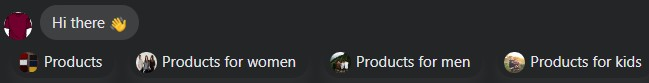
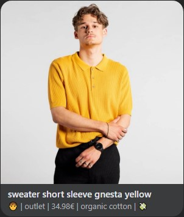
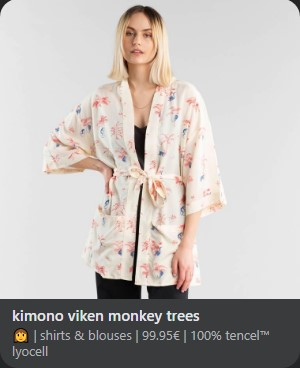
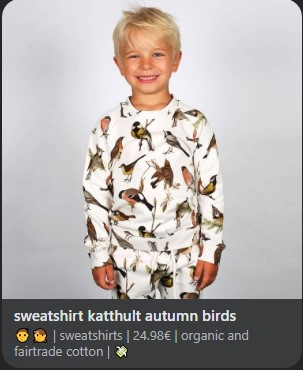

# Fashion bot 👕🧣🤖 - ESILV

This is a Facebook chatbot made with ❤ and 👕- School project. 

Using clothes from [Dedicated brand](https://www.dedicatedbrand.com/en/) website, we created : 

- A first API : to query products stored in a MongoDB Database 💾
- A second API : to make recommendation with Python using cosine 👨‍🏫👩‍🏫
- A Facebook Messenger Chatbot powered with NLP (from wit.ai) 🤖

# Backend APIs 👩‍💻💻

## Dedicated brand 👔👕

Instead of using an existing API to gather data, **we created our own** using Node.js and MongoDB. We reused an API we designed in [another course](https://github.com/92bondstreet/clear-fashion/blob/master/workshops/5-api-express.md) and adapted it to our needs.

It can query the **mongoDB** database 💾 in order to :

- Get a number of random, filtered products 
- Save the likes and dislikes of a user

It communicates using 2 endpoints and responde with status, data and messages so we can tell our user communicating with the chatbot, what's going on :

- If all went well ✅
- If not products were found 🔎
- If there is a problem with the database ❌

The API has been deployed using [vercel](https://vercel.com/) ☁

## Recommendation system 📂📝

***TO BE CONTINUED***

# Chatbot 📣💭

Our chatbot is named fashionBot, why ? Because it's fashion driven ! 👕

## Super user friendly 🥰

fashionBot is really nice and friendly : 

 - It uses emojis 🖖👋
 - It says hello in a different way so it can feel more like a human being 👩👨
 - When you say hello, it'll answer and buttons will pop so you can make fast querry ⚡
 - It tells you if he doesn't understands with cute sad eyes so you won't be mad at him 🥺
 - It tells you what's going on with the things you asked ! (Number of products founds, if the products you like has been stored...) ❌❔✅

## He understands pretty well 💡🔍

Since it has been train using wit.ai, it can understands multiple things and make really complex query to find THE product of your dream 💭

When you ask him something, he'll always show you 3 products. (Disclaimer : since mongoDB select randoms products, you can have the same products two times in the selection. But we have over 1300 products stored, so it's bad luck if you have that 🤷‍♂️). 

## It has a nice design 

We used templates to present our products. The *emoji is adapted* for the genre of the product (men 🧑, women 👩, kids 👦👧). There is the *category* of the product, the *price*, the *material* and an emoji 💸 if it's *on sale* !

|         Men, on sale                                        |  Women, not on sale    | Kids on sale |
:---:                                                         |:---: |:---: |
|  |      | |

## So, what can you ask ? 🤔🕵️‍♀️ 

Keep in mind that you can combine all the query to make a super complex query. It will understands. 

- >Give me products" will return 3 randoms products
- >Give me **[color]** products
- >Give me products costing **<more|less>** than **[price]** €
- >Give me prodcuts **(not) on** sale
- >Give me products in **organical cotton**
- >Give me products for **<men|women|kids>**

Wanna spice things up ? 🔥 Ask for this:

>Give me red products for men, costing less than 80€, on sale, in organic and fairtrade cotton for men

---

**By Vincent DEBANDE and Ludovic CHEVALLIER 
ESILV - M1 Data Science and Artificial Intelligence**
